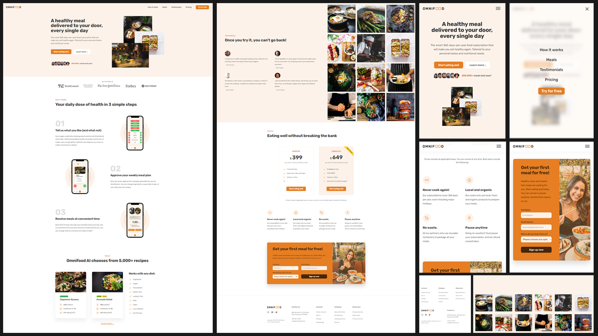

[**OMNIFOOD**](https://rodrigozandeoliveira.github.io/Omnifood/)

##

**ABOUT OMNIFOOD PROJECT**

- Omnifood is fictional brand used by by ["Jonas Schmedtmann"](https://www.udemy.com/course/design-and-develop-a-killer-website-with-html5-and-css3/?kw=build+responsive+real&src=sac#instructor-1) during his course ["Build Responsive Real-World Websites with HTML and CSS"](https://www.udemy.com/course/design-and-develop-a-killer-website-with-html5-and-css3/?kw=build+responsive+real&src=sac#instructor-1) for us to build a landing page.
- This project was the most complete project of this course where it was covered many different topics of HTML and CSS development such as design process/steps, different sections of the page (heading, hero section, footer, ...) and make it responsive by using queries.

##
